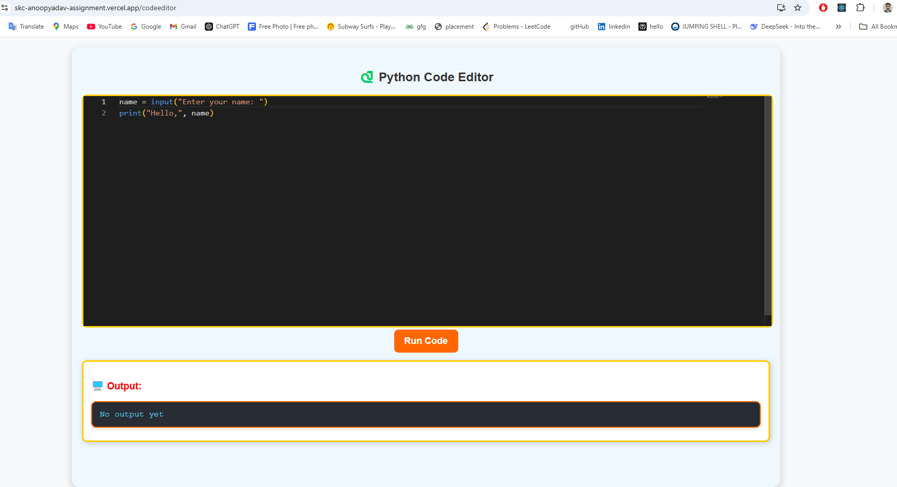
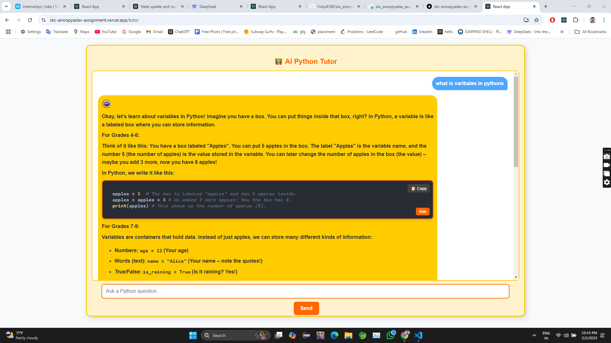

# Homework Feature with Gemini AI Integration

This React app allows you to assign homework to children using Gemini AI and includes interactive features like quizzes. You can customize the AI tutor based on the child’s interests and provide engaging homework assignments.

## Features

- **Dynamic Homework Assignment**: Assign homework based on the child’s subject or lesson.
- **Customizable AI Tutor**: AI adapts to the child’s learning preferences.
- **Interactive Homework**: Includes interactive quizzes at the end of homework assignments to enhance learning.

## Screenshots

-   

-   


## Prerequisites

Before you begin, make sure you have the following installed:

- [Node.js](https://nodejs.org/) (LTS version)
- [npm](https://www.npmjs.com/) or [yarn](https://yarnpkg.com/) (Node package managers)

## Installation

### 1. Clone the repository

First, clone the repository to your local machine:

```bash
git clone https://github.com/Vicky8180/skc_anoopyadav_assignment
cd skc_anoopyadav

```

Craete .env file in both frontend and backend 

```
Frontend .env file,  REACT_APP_BASE_URL_PORT
Backend .env file, GEMINI_API_KEY ="Your gemini api key"
                 PORT=5000


```
